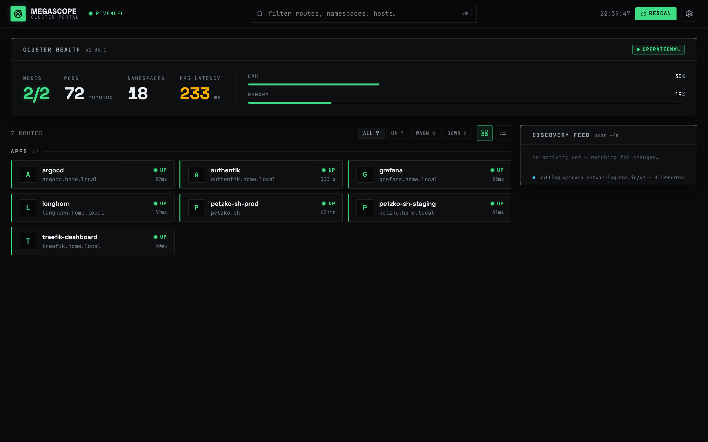
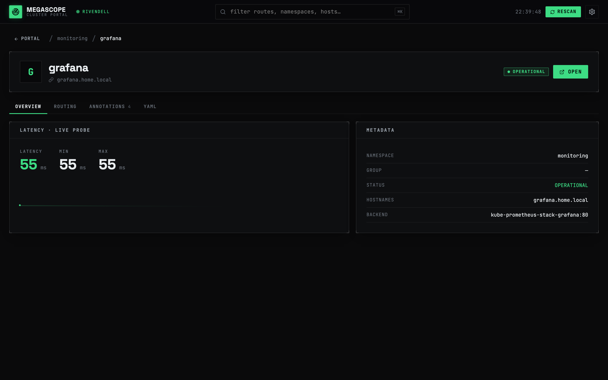
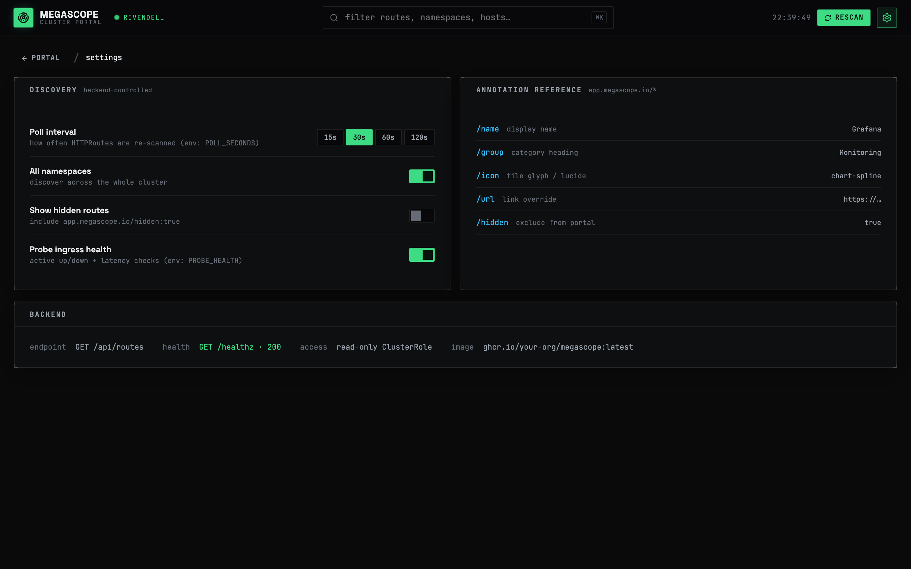

<p align="center">
  
</p>

<h1 align="center">megascope</h1>

<p align="center">
  A self-hosted, auto-discovering homepage for <strong>any Kubernetes cluster</strong>.
</p>

<p align="center">
  <a href="https://github.com/petzkod5/megascope/actions/workflows/ci.yml"></a>
  <a href="https://github.com/petzkod5/megascope/actions/workflows/build.yml"></a>
  <a href="LICENSE"></a>
</p>

megascope auto-discovers Gateway API **HTTPRoutes** and presents every app as a
single command-center dashboard — no manual config, new apps appear on their own.
Open-source and cluster-agnostic: nothing here is tied to a specific cluster.

> In *The Witcher*, a megascope lets you see and reach people across great
> distances. This one does the same for your cluster.



## Features

- **Zero-config discovery** — finds every Gateway API HTTPRoute across all
  namespaces and groups them into a tile grid. New routes appear automatically.
- **Live health** — active probes give each app an up / warn / down status and
  latency; a cluster health bar shows nodes, pods, namespaces, version, and
  CPU/memory commitment.
- **Discovery feed** — a running log of discovered / removed / degraded routes.
- **Per-app detail** — overview (live latency sparkline), real gateway routing,
  HTTPRoute annotations, and a generated YAML manifest.
- **Customisable tiles** — apps opt into names, groups, icons, and links via
  `app.megascope.io/*` annotations.
- **Filter & search** — `⌘K` search plus status filters; grid or list view.
- **Tiny & locked-down** — a single distroless, non-root, read-only image; the
  Go backend is stdlib-only (no client-go) and only ever *reads* the cluster.

<p align="center">
  
  
</p>

## How it works

- **Backend (Go):** talks to the in-cluster Kubernetes API with its mounted
  ServiceAccount token (no client-go — a tiny dependency-free static binary).
  Each scan it:
  - lists `HTTPRoute`s across all namespaces (discovery);
  - probes each route's URL to derive **status** (up / warn / down) and
    **latency** (set `PROBE_HEALTH=false` to disable);
  - reads nodes / pods / namespaces / version for a **cluster health summary**
    (incl. CPU & memory commitment from requests vs. allocatable);
  - diffs scan-to-scan to build a live **activity feed**;
  - keeps a short per-route latency history so the detail sparkline survives
    reloads.

  It serves the whole thing at `GET /api/routes`, plus the built frontend,
  `GET /healthz`, and Prometheus metrics at `GET /metrics`.
- **Frontend (React/TS, Vite):** a command-center portal — cluster health bar,
  grouped status-LED tiles, a live discovery feed, per-app detail (overview /
  routing / annotations / YAML), and a settings reference. The look comes from
  the Megascope design system (Claude Design handoff): mono-forward, OLED-dark,
  square-edged, signal-green. Icons via `lucide-react`.

Single image: the Go binary serves both the API and the static SPA.

## Configuration (backend env)

| Var            | Default     | Meaning                                     |
| -------------- | ----------- | ------------------------------------------- |
| `PROBE_HEALTH` | `true`      | Probe route URLs for status/latency.        |
| `POLL_SECONDS` | `30`        | Scan interval.                              |
| `CLUSTER_NAME` | `production` | Name shown in the top bar / health panel.  |
| `KUBE_API`     | _(unset)_   | Point at `kubectl proxy` for local testing. |
| `ADDR`         | `:8080`     | Listen address.                             |
| `WEB_DIR`      | `./web`     | Built SPA directory.                        |

## Customising a tile

Annotate an app's `HTTPRoute` to control how it appears (all optional):

```yaml
metadata:
  annotations:
    app.megascope.io/name: "Grafana"      # display name (default: route name)
    app.megascope.io/group: "Monitoring"  # category heading
    app.megascope.io/icon: "chart-spline" # lucide icon name or emoji
    app.megascope.io/url: "http://..."    # link override (default: http://<hostname>)
    app.megascope.io/hidden: "true"       # exclude from the portal
```

## Develop / test locally

The backend reads the cluster API the in-cluster way, so on a laptop point it at
your cluster via `kubectl proxy` (sets `KUBE_API` — no TLS/token needed):

```bash
# terminal A — proxy the cluster API (uses your kubeconfig)
kubectl proxy --port=8001

# terminal B — backend, talking to the proxy
cd backend && KUBE_API=http://localhost:8001 go run .        # :8080, real routes

# terminal C — frontend (proxies /api -> :8080)
cd frontend && npm install && npm run dev                    # open the printed URL
```

Without `KUBE_API` and outside the cluster, the backend still serves but
discovery is disabled (empty portal) — fine for checking the UI.

## Build

CI builds and publishes the image automatically. The
[`build`](.github/workflows/build.yml) workflow builds a multi-arch
(`linux/amd64,linux/arm64`) image and pushes it to
`ghcr.io/<owner>/megascope` on every push to `main` (tagged `latest`) and on
version tags (`vX.Y.Z`). Pull requests build only.

On `v*` tags the [`chart-publish`](.github/workflows/build.yml) job also packages the
Helm chart and pushes it to `oci://ghcr.io/<owner>/charts/megascope` (chart version = tag).

To build locally:

```bash
docker build -t ghcr.io/petzkod5/megascope:latest .
```

## Deploy (Helm)

megascope ships as a parameterized Helm chart in [`charts/megascope`](charts/megascope)
— see its [README](charts/megascope/README.md) for the full values reference.

```bash
helm install megascope ./charts/megascope \
  --namespace megascope --create-namespace \
  --set 'httproute.parentRefs[0].name=<your-gateway>' \
  --set 'httproute.parentRefs[0].namespace=<gateway-ns>' \
  --set 'httproute.hostnames[0]=megascope.example.com'
```

Or install straight from the published OCI chart (no clone needed):

```bash
helm install megascope oci://ghcr.io/petzkod5/charts/megascope \
  --version <X.Y.Z> --namespace megascope --create-namespace \
  --set 'httproute.parentRefs[0].name=<your-gateway>' \
  --set 'httproute.parentRefs[0].namespace=<gateway-ns>' \
  --set 'httproute.hostnames[0]=megascope.example.com'
```

The chart creates a ServiceAccount, a read-only `ClusterRole` (HTTPRoutes +
nodes/pods/namespaces, for the health summary), the Deployment/Service, and an
HTTPRoute (or Ingress, via `ingress.enabled`). It's plain Helm, so it also drops
straight into an ArgoCD Application pointed at `charts/megascope`.

## Notes

- Single-cluster by design for now.
- The backend only ever **reads** the cluster (discovery + health summary); it
  has no write access. Health probes are plain outbound `GET`s to each route.
